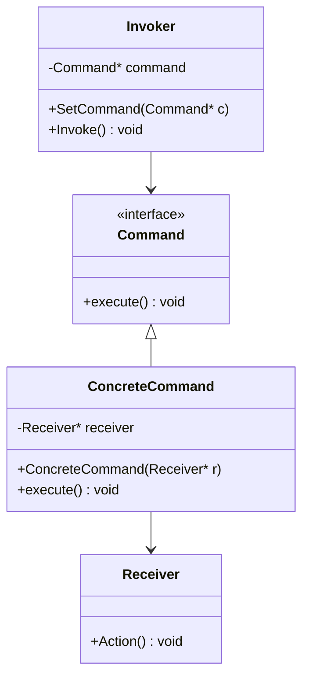

## 意图
将一个请求封装成一个对象，从而允许你使用不同的请求、队列或日志将客户端参数化，同时支持请求操作的撤销与恢复。
> 命令就是面吸纳该对象化的回调

## UML类图


## 示例代码
```cxx
class Command{
public:
    virtual ~Command() = default;
    virtual void execute() = 0;
};

class Receiver{
public:
    void Action(){
        std::cout << "Receiver: Executing action.\n";
    }
};

class ConcreteCommand : public Command{
public:
    explicit ConcreteCommand(Receiver* _receiver) : m_Receiver(_receiver) { }
    void execute() override{
        m_Receiver->Action();
    }
    
private:
    Receiver* m_Receiver;
};

class Invoker{
public:
    void SetCommand(Command* _command) { m_Command = _command; }
    void Invoke(){
        if(m_Command){
            m_Command->execute();
        }
    }
};

int main(){
    Receiver receiver;
    ConcreteCommand cmd(&receiver);
    Invoker invoker;

    invoker.SetCommand(&cmd);
    invoker.Invoke();
}
```

## 应用场景
- 配置输入
- 角色
- 撤销/重做
- 网络请求/任务队列

## 总结
| 角色                  | 作用             |
| ------------------- | -------------- |
| **Command**         | 抽象命令接口，定义执行操作  |
| **ConcreteCommand** | 封装具体命令，实现执行逻辑  |
| **Receiver**        | 真正执行操作的类       |
| **Invoker**         | 调用命令，不依赖具体实现   |
| **Client**          | 创建命令并绑定接收者与调用者 |
