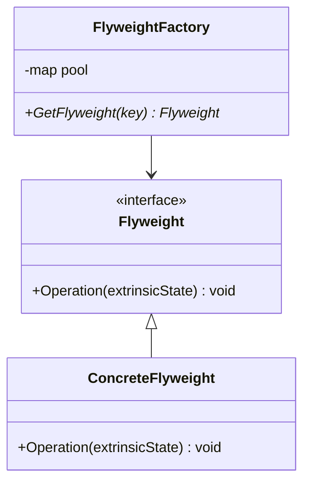

## 意图
使用共享以高效地支持大量的细粒度对象
常用于减少对象数量、节省内存

## UML类图


## 示例代码
```cxx
class Flyweight{
public:
    virtual ~Flyweight() = default;
    virtual void Operation(const std::string& extrinsicState) = 0;
};

class ConcreteFlyweight : public Flyweight{
public:
    explicit ConcreteFlyweight(std::string _state) : m_IntrinsicState(_state) { }

    void Operation(const std::string& extrinsicState) override{

    }

private:
    std::string m_IntrinsicState;
};

class FlyweightFactory{
public:
    std::shared_ptr<Flyweight> GetFlyweight(const std::string& key){
        if(m_Pool.find(key) == m_Pool.end()){
            m_Pool[key] = std::make_shared<ConcreteFlyweight>(key);
        }else{

        }

        return m_Pool[key];
    }

private:
    std::unordered_map<std::string, std::shared_ptr<Flyweight>> m_Pool;
}
```

## 应用场景
- 渲染
- 字体系统
- 对象池
- 文本编辑器

## 总结
| 概念                        | 含义                           |
| ------------------------- | ---------------------------- |
| **Intrinsic State** | 可共享的、不随外部环境改变的部分（如纹理ID、模型数据） |
| **Extrinsic State** | 依赖环境变化的部分（如位置、缩放、颜色）         |
| **FlyweightFactory**      | 管理并复用享元对象                    |
| **Client**                | 组合共享对象与外部状态使用                |

