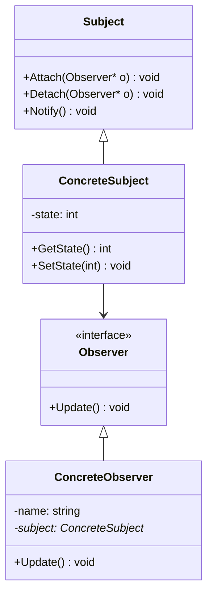

## 意图
在对象间定义一种一对多的依赖关系，以便当某对象的状态改变时，与它存在依赖关系的所有对象都能收到通知并自动进行更新

## UML 类图


## 示例代码
```cxx
class Observer{
public:
    virtual ~Observer() = default;
    virtual void Update(int _state) = 0;
};

class Subject{
public:
    virtual ~Subject() = default;

    virtual void Attach(Observer* _obs) = 0;
    virtual void Detach(Observer* _obs) = 0;
    virtual void Notify() = 0;
};

class ConcreteObserver : public Observer{
public:
    ConcreteObserver(const std::string& _name, Subject* _subject) : m_Name(std::move(_name)), m_Subject(_subject) { }
    void Update(int _state) override{

    }

private:
    std::string m_Name;
    Subject* m_Subject;
};

class ConcreteSubject : public Subject{
public:
    inline void SetState(int _state) { m_State = s; Notify(); }
    inline int GetState() const { return m_State; }

    void Attach(Observer* _obs) override{
        m_Observers.push_back(_obs);
    }
    void Detach(Observer* _obs){
        m_Observers.erase(std::remove(m_Observers.begin(), m_Observers.end(), _obs), m_Observers.end());
    }
    void Notify() override{
        for(auto* obs : m_Observers){
            obs->Update();
        }
    }

private:
    int m_State;
    std::vector<Observer*> m_Observers;
};

int main(){
    ConcreteSubject* subject = new ConcreteSubject();   
    ConcreteObserver* obs1("A", subject), obs2("B", subject);

    subject.Attach(obs1);
    subject.Attach(obs2);

    subject.SetState(1);

    return 0;
}
```

## 应用场景
- 事件系统
- UI框架
- 消息系统
- 文件监听

## 总结
| 角色                   | 职责                 |
| -------------------- | ------------------ |
| **Subject（主题）**      | 保存观察者列表；状态变化时通知观察者 |
| **Observer（观察者）**    | 定义更新接口             |
| **ConcreteSubject**  | 实现状态与通知逻辑          |
| **ConcreteObserver** | 实现具体的响应行为          |

